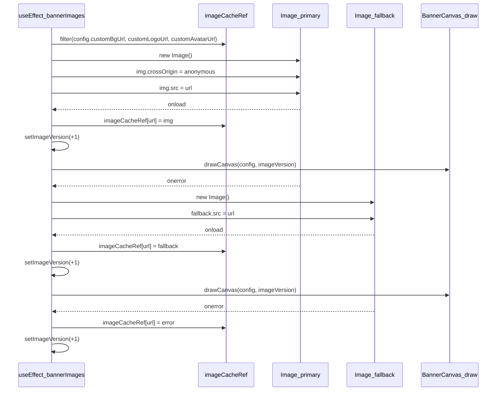

# Generated by sourcery-ai[bot]: start review_guide 

## Reviewer's Guide

Integrates avatar rendering into the banner canvas, embeds the real banner inside the LinkedIn mock profile, and introduces new Supabase/server and Vercel speed insights dependencies along with responsive layout and text-fitting improvements.

### Sequence diagram for avatar image loading with CORS fallback



### File-Level Changes

| Change | Details | Files |
| ------ | ------- | ----- |
| BannerCanvas gains embedded mode, avatar rendering, and improved text fitting and pill layout. | <ul><li>Add optional embedded flag to BannerCanvas props and use it to toggle container id and framing (border, radius, shadow).</li><li>Introduce fitFont and wrapTagline helpers to auto-shrink and wrap name, title, tagline, and subtitle to stay within safe text bounds.</li><li>Rework skills badge layout to wrap across up to two rows within a right boundary instead of silently dropping overflow pills.</li><li>Define shared avatar zone geometry for desktop and mobile, render the avatar image clipped to a circle with a framing ring, and adjust the safe-zone overlay to reuse this geometry and avoid covering the avatar.</li><li>Extend image preloading to include avatar URLs and add a crossOrigin retry fallback path to maximize live preview rendering despite CORS issues.</li></ul> | `src/components/BannerCanvas.tsx` |
| App layout and defaults are tuned for better readability, responsiveness, and a new stock avatar image. | <ul><li>Reformat imports, DEFAULT_CONFIG fields, and button handlers for readability and consistent style.</li><li>Update the default customAvatarUrl to point at a new GCS-hosted stock headshot image.</li><li>Loosen BannerConfig typing in handleUpdateConfig to accept Partial updates without type complaints.</li><li>Make the header bar more responsive with adjusted padding, flex-wrap, and hiding long subtitle text on small screens.</li><li>Adjust grid column breakpoints from lg to xl for the controls/preview split so mid-width screens get stacked layouts instead of cramped two-column views.</li><li>Tighten className and JSX formatting across main layout and action buttons for consistency.</li></ul> | `src/App.tsx` |
| MockProfile now embeds the real BannerCanvas and uses a more realistic, responsive avatar overlay. | <ul><li>Replace the previous schematic banner mock with an embedded BannerCanvas instance configured to hide the safe-zone guide and suppress its own avatar rendering.</li><li>Add a circular avatar overlay positioned to overlap the banner bottom edge, scaling size via aspect-square and percentage-based height so it tracks the banner card size.</li><li>Ensure the avatar overlay uses the actual customAvatarUrl when present, falling back to initials in a text badge when absent.</li><li>Simplify and resize fallback label typography so it remains legible on smaller viewports.</li></ul> | `src/components/MockProfile.tsx` |
| EditorPanel tab labels are made more compact on small screens for improved responsiveness. | <ul><li>Hide text labels for the Identity, Theme & Style, Skills Pills, Highlights, and Images tabs on small screens while preserving icons, by wrapping the label spans in hidden md:inline.</li><li>Keep existing active-tab styling and behavior unchanged while optimizing tab bar space.</li></ul> | `src/components/EditorPanel.tsx` |
| Project dependencies and runtime are updated to support Supabase server usage, Vercel speed insights, and some security-conscious overrides. | <ul><li>Rename the package from react-example to cover-studio to reflect the app identity.</li><li>Add @supabase/server and @vercel/speed-insights to dependencies to enable server-side Supabase usage and performance analytics.</li><li>Remove vite from devDependencies and add an overrides section for js-yaml, smol-toml, minimatch@10, ajv, and selected @vercel/node transitive deps to pin safer versions.</li><li>Add an allowScripts whitelist for specific packages such as @google/genai and several esbuild and protobufjs versions.</li><li>Wire SpeedInsights into the React root render tree so performance metrics are collected at runtime.</li></ul> | `package.json`<br/>`src/main.tsx` |
| Editor tooling configuration is introduced for spell checking. | <ul><li>Create a .vscode/settings.json file to configure workspace-level spelling support (e.g., Code Spell Checker).</li></ul> | `.vscode/settings.json` |
| Lockfile is regenerated to capture new dependencies and overrides. | <ul><li>Update package-lock.json to reflect the new project name, added dependencies (@supabase/server, @vercel/speed-insights), overrides, and allowScripts configuration.</li></ul> | `package-lock.json` |

---

<details>
<summary>Tips and commands</summary>

#### Interacting with Sourcery

- **Trigger a new review:** Comment `@sourcery-ai review` on the pull request.
- **Continue discussions:** Reply directly to Sourcery's review comments.
- **Generate a GitHub issue from a review comment:** Ask Sourcery to create an
  issue from a review comment by replying to it. You can also reply to a
  review comment with `@sourcery-ai issue` to create an issue from it.
- **Generate a pull request title:** Write `@sourcery-ai` anywhere in the pull
  request title to generate a title at any time. You can also comment
  `@sourcery-ai title` on the pull request to (re-)generate the title at any time.
- **Generate a pull request summary:** Write `@sourcery-ai summary` anywhere in
  the pull request body to generate a PR summary at any time exactly where you
  want it. You can also comment `@sourcery-ai summary` on the pull request to
  (re-)generate the summary at any time.
- **Generate reviewer's guide:** Comment `@sourcery-ai guide` on the pull
  request to (re-)generate the reviewer's guide at any time.
- **Resolve all Sourcery comments:** Comment `@sourcery-ai resolve` on the
  pull request to resolve all Sourcery comments. Useful if you've already
  addressed all the comments and don't want to see them anymore.
- **Dismiss all Sourcery reviews:** Comment `@sourcery-ai dismiss` on the pull
  request to dismiss all existing Sourcery reviews. Especially useful if you
  want to start fresh with a new review - don't forget to comment
  `@sourcery-ai review` to trigger a new review!

#### Customizing Your Experience

Access your [dashboard](https://app.sourcery.ai) to:

- Enable or disable review features such as the Sourcery-generated pull request
  summary, the reviewer's guide, and others.
- Change the review language.
- Add, remove or edit custom review instructions.
- Adjust other review settings.

#### Getting Help

- [Contact our support team](mailto:support@sourcery.ai) for questions or feedback.
- Visit our [documentation](https://docs.sourcery.ai) for detailed guides and information.
- Keep in touch with the Sourcery team by following us on [X/Twitter](https://x.com/SourceryAI), [LinkedIn](https://www.linkedin.com/company/sourcery-ai/) or [GitHub](https://github.com/sourcery-ai).

</details>

<!-- Generated by sourcery-ai[bot]: end review_guide -->

Hey - I've found 1 issue, and left some high level feedback:

- In App.tsx, changing `setConfig((prev) => ({ ...prev, ...updates }))` to `setConfig((prev: any) => ...)` unnecessarily drops type safety on `BannerConfig`; keep `prev` typed as `BannerConfig` (or infer it) so invalid config shapes are caught at compile time.

<details>
<summary>Prompt for AI Agents</summary>

~~~markdown
Please address the comments from this code review:

## Overall Comments
- In App.tsx, changing `setConfig((prev) => ({ ...prev, ...updates }))` to `setConfig((prev: any) => ...)` unnecessarily drops type safety on `BannerConfig`; keep `prev` typed as `BannerConfig` (or infer it) so invalid config shapes are caught at compile time.

## Individual Comments

### Comment 1
<location path="src/App.tsx" line_range="77" />
<code_context>

   const handleUpdateConfig = (updates: Partial<BannerConfig>) => {
-    setConfig((prev) => ({ ...prev, ...updates }));
+    setConfig((prev: any) => ({ ...prev, ...updates }));
   };

</code_context>
<issue_to_address>
**suggestion (bug_risk):** Using `any` for prev in setConfig loses type safety on BannerConfig updates.

Typing `prev` as `any` removes the compiler’s guarantee that `updates: Partial<BannerConfig>` matches the config shape, increasing the risk of subtle type mismatches. Please keep `prev` typed as `BannerConfig`, either via inference:

```ts
setConfig((prev) => ({ ...prev, ...updates }));
```

or with an explicit annotation:

```ts
setConfig((prev: BannerConfig) => ({ ...prev, ...updates }));
```

Suggested implementation:

```typescript
  const triggerExportRef = useRef<() => void>(() => {});

  const handleUpdateConfig = (updates: Partial<BannerConfig>) => {

```

```typescript
  const handleUpdateConfig = (updates: Partial<BannerConfig>) => {
    setConfig((prev: BannerConfig) => ({ ...prev, ...updates }));
  };

// Neutral, fictional demo profile — no real personal data (org privacy rule).
const DEFAULT_CONFIG: BannerConfig = {

```

```typescript
  const handleUpdateConfig = (updates: Partial<BannerConfig>) => {
    setConfig((prev: BannerConfig) => ({ ...prev, ...updates }));
  }

// Neutral, fictional demo profile — no real personal data (org privacy rule).

```

1. Ensure `BannerConfig` is correctly imported or declared in `src/App.tsx` so the explicit `BannerConfig` type annotation compiles.
2. If `setConfig` is declared with a specific `useState<BannerConfig>(...)` type, the compiler can infer `prev` as `BannerConfig`; in that case you may alternatively remove the explicit type annotation and use `setConfig((prev) => ({ ...prev, ...updates }));`.
</issue_to_address>
~~~

</details>

***

<details>
<summary>Sourcery is free for open source - if you like our reviews please consider sharing them ✨</summary>

- [X](https://twitter.com/intent/tweet?text=I%20just%20got%20an%20instant%20code%20review%20from%20%40SourceryAI%2C%20and%20it%20was%20brilliant%21%20It%27s%20free%20for%20open%20source%20and%20has%20a%20free%20trial%20for%20private%20code.%20Check%20it%20out%20https%3A//sourcery.ai/%3Futm_source%3Dtwitter%26utm_medium%3Dsocial%26utm_campaign%3Dbot_review_share)
- [Mastodon](https://mastodon.social/share?text=I%20just%20got%20an%20instant%20code%20review%20from%20%40SourceryAI%2C%20and%20it%20was%20brilliant%21%20It%27s%20free%20for%20open%20source%20and%20has%20a%20free%20trial%20for%20private%20code.%20Check%20it%20out%20https%3A//sourcery.ai/%3Futm_source%3Dmastodon%26utm_medium%3Dsocial%26utm_campaign%3Dbot_review_share)
- [LinkedIn](https://www.linkedin.com/sharing/share-offsite/?url=https%3A//sourcery.ai/%3Futm_source%3Dlinkedin%26utm_medium%3Dsocial%26utm_campaign%3Dbot_review_share)
- [Facebook](https://www.facebook.com/sharer/sharer.php?u=https%3A//sourcery.ai/%3Futm_source%3Dfacebook%26utm_medium%3Dsocial%26utm_campaign%3Dbot_review_share)

</details>

<sub>
Help me be more useful! Please click 👍 or 👎 on each comment and I'll use the feedback to improve your reviews.
</sub>

**suggestion (bug_risk):** Using `any` for prev in setConfig loses type safety on BannerConfig updates.

Typing `prev` as `any` removes the compiler’s guarantee that `updates: Partial<BannerConfig>` matches the config shape, increasing the risk of subtle type mismatches. Please keep `prev` typed as `BannerConfig`, either via inference:

```ts
setConfig((prev) => ({ ...prev, ...updates }));
```

or with an explicit annotation:

```ts
setConfig((prev: BannerConfig) => ({ ...prev, ...updates }));
```

Suggested implementation:

```typescript
  const triggerExportRef = useRef<() => void>(() => {});

  const handleUpdateConfig = (updates: Partial<BannerConfig>) => {

```

```typescript
  const handleUpdateConfig = (updates: Partial<BannerConfig>) => {
    setConfig((prev: BannerConfig) => ({ ...prev, ...updates }));
  };

// Neutral, fictional demo profile — no real personal data (org privacy rule).
const DEFAULT_CONFIG: BannerConfig = {

```

```typescript
  const handleUpdateConfig = (updates: Partial<BannerConfig>) => {
    setConfig((prev: BannerConfig) => ({ ...prev, ...updates }));
  }

// Neutral, fictional demo profile — no real personal data (org privacy rule).

```

1. Ensure `BannerConfig` is correctly imported or declared in `src/App.tsx` so the explicit `BannerConfig` type annotation compiles.
2. If `setConfig` is declared with a specific `useState<BannerConfig>(...)` type, the compiler can infer `prev` as `BannerConfig`; in that case you may alternatively remove the explicit type annotation and use `setConfig((prev) => ({ ...prev, ...updates }));`.
